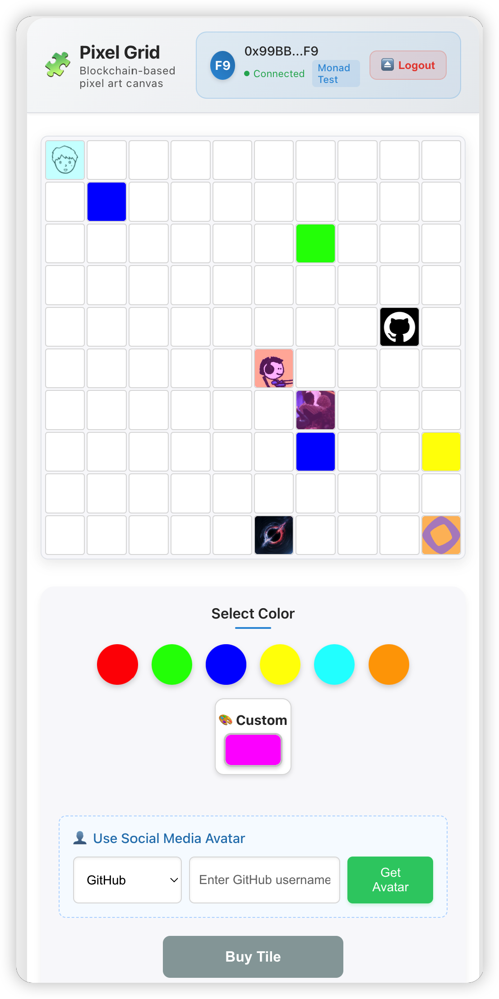

# 使用 Monad 构建区块链像素艺术画布

## 引言

Monad是一个高性能的Layer-1区块链平台，专为解决以太坊的可扩展性问题而设计。它采用了创新的状态管理方法和优化的执行环境，使开发者能够构建高吞吐量的去中心化应用。作为一个兼容EVM（以太坊虚拟机）的公链，Monad保留了以太坊的开发便利性，同时显著提升了交易处理速度和降低了Gas费用。

OpenBuild 推出了 [Monad 101 Bootcamp](https://openbuild.xyz/learn/challenges/2060691796) 后积极参与 再老师的指导下，开发了基于Monad的像素画板Pixel Grid

## 项目概述

Pixel Grid是一个基于区块链的像素艺术平台，具有以下核心功能：

- **钱包连接**：用户可以连接MetaMask等加密钱包
- **像素购买**：用户可以使用数字货币购买网格中的像素方块
- **自定义设计**：为方块设置不同颜色或上传个性化图片
- **社交集成**：直接使用GitHub或Twitter的头像作为方块图片

每个像素方块作为区块链上的数字资产，由用户真正拥有，共同构成一个社区协作的艺术画布。

体验地址：<https://pixel-grid-chain.vercel.app/>



## 技术栈详解

本项目采用现代Web3开发栈：

| 技术领域 | 使用的库/框架 | 用途 |
|---------|-------------|------|
| 前端框架 | React.js | 构建用户界面 |
| 状态管理 | React Hooks | 管理组件状态 |
| 样式处理 | Styled Components | 组件级CSS样式 |
| Web3连接 | wagmi、RainbowKit | 简化钱包连接流程 |
| 合约交互 | viem | 处理智能合约调用 |
| 区块链网络 | Monad Testnet | 存储数字资产 |

## 核心功能实现

### 1. 钱包连接实现

使用RainbowKit库为用户提供简单直观的钱包连接体验，支持多种主流钱包：

```jsx
import { ConnectButton } from '@rainbow-me/rainbowkit';

// 自定义钱包连接按钮
const WalletConnectButton = () => (
  <ConnectButton.Custom>
    {({
      account,
      chain,
      openConnectModal,
      authenticationStatus,
      mounted,
    }) => {
      const ready = mounted && authenticationStatus !== 'loading';
      const connected = ready && account && chain;

      return (
        <div>
          {!connected && (
            <Button onClick={openConnectModal}>
              Connect Wallet
            </Button>
          )}
          {connected && (
            <WalletInfo>
              <AccountDisplay>{account.displayName}</AccountDisplay>
              <NetworkDisplay>{chain.name}</NetworkDisplay>
            </WalletInfo>
          )}
        </div>
      );
    }}
  </ConnectButton.Custom>
);
```

### 2. 区块链数据读取与处理

通过wagmi的hooks优雅地从智能合约读取像素方块数据：

```jsx
// 读取所有方块数据
const { data: earthsData, refetch } = useContractRead({
  address: contractAddress,
  abi: contractABI,
  functionName: 'getEarths',
  watch: true, // 自动监听区块链更新
});

// 数据处理与格式化
useEffect(() => {
  if (earthsData) {
    // 处理BigInt类型并格式化数据
    const earthDataArray = Array.from(earthsData).map(earth => ({
      color: Number(earth.color),
      price: Number(earth.price),
      image_url: earth.image_url
    }));
    
    setEarthData(earthDataArray);
    console.log("数据已更新:", earthDataArray.length);
  }
}, [earthsData]);
```

### 3. 像素方块购买流程

结合`useContractWrite`和`useWaitForTransaction` hooks实现无缝的交易体验：

```jsx
// 购买方块交易准备
const { write: buyEarthWrite, data: buyEarthData } = useContractWrite({
  address: contractAddress,
  abi: contractABI,
  functionName: 'buyEarth',
  value: parseEther('0.01'), // 设置购买价格
});

// 交易状态监控
const { isLoading, isSuccess, isError } = useWaitForTransaction({
  hash: buyEarthData?.hash,
  onSuccess: () => {
    showToast("购买成功！", "success");
    refetch(); // 刷新数据
    setSelectedTile(null);
  },
  onError: (error) => {
    handleTransactionError(error);
  }
});

// 处理购买方块的用户操作
const handleBuyEarth = () => {
  // 参数验证
  if (selectedTile === null) {
    showToast("请先选择一个方块", "error");
    return;
  }
  
  const hasColor = selectedColor !== 0;
  const hasImage = imageUrl.trim() !== "";
  
  if (!hasColor && !hasImage) {
    showToast("请选择颜色或提供图片URL", "error");
    return;
  }
  
  // 执行交易
  try {
    buyEarthWrite({
      args: [selectedTile, selectedColor, imageUrl.trim()],
      onSettled: (data, error) => {
        if (error) handleTransactionError(error);
      }
    });
  } catch (error) {
    console.error("交易发起错误:", error);
    handleTransactionError(error);
  }
};
```

### 4. 社交媒体头像集成

实现从多个平台无缝获取用户头像：

```jsx
// 获取用户头像URL的处理函数
const handleGetAvatarUrl = async () => {
  if (!username) {
    showToast("请输入用户名", "error");
    return;
  }
  
  try {
    let avatarUrl;
    
    // 显示加载状态
    showToast(`正在获取${platform === 'github' ? 'GitHub' : 'Twitter'}头像...`, "info");
    
    // 根据平台获取头像
    if (platform === "custom") {
      // 处理自定义URL
      if (!isValidUrl(username)) {
        showToast("请输入有效的URL", "error");
        return;
      }
      avatarUrl = username;
    } else {
      // 使用API获取社交媒体头像
      avatarUrl = await getAvatarUrlAsync(platform, username);
      
      // 处理获取失败的情况
      if (!avatarUrl) {
        if (platform === 'twitter') {
          setTwitterFetchFailed(true);
          showToast("无法获取Twitter头像，请尝试手动方法", "error");
        } else {
          showToast(`无法获取${platform}头像`, "error");
        }
        return;
      }
    }
    
    // 预览和应用头像
    setPreviewUrl(avatarUrl);
    setImageUrl(avatarUrl);
    setShowPreview(true);
    
    showToast("头像获取成功！", "success");
  } catch (error) {
    console.error("头像获取错误:", error);
    showToast("获取头像失败", "error");
  }
};
```

## 优化细节

### 1. 图像与颜色混合效果

为实现最佳视觉体验，我们对图片和颜色层进行了精心设计：

```jsx
// 背景颜色层 - 为有图片的方块调整透明度
const ColorBackground = styled.div`
  position: absolute;
  top: 0;
  left: 0;
  width: 100%;
  height: 100%;
  background-color: ${props => props.color};
  opacity: ${props => props.$hasImage ? 0.7 : 1}; // 有图片时降低背景不透明度
  border-radius: 3px;
  z-index: 1;
  pointer-events: none;
`;

// 图片层 - 只在有背景色时调整透明度
const TileImage = styled.img`
  width: 100%;
  height: 100%;
  object-fit: cover;
  position: absolute;
  top: 0;
  left: 0;
  opacity: ${props => props.$hasColor ? 0.6 : 1}; // 有颜色时降低图片不透明度
  mix-blend-mode: normal;
  border-radius: 3px;
  filter: contrast(1.05); // 提高对比度使图片更清晰
  z-index: 2;
`;
```

这种实现方式确保了：

- 当只有颜色时，显示纯色背景
- 当只有图片时，显示高清图片
- 当同时有颜色和图片时，创建半透明混合效果

## 总结

这种将像素艺术与区块链技术相结合的方式，不仅为数字创作提供了新的可能性，也为用户参与Web3生态系统提供了一个友好的入口点。

希望本教程能帮助你更深入地理解如何构建去中心化应用，激发你创造出更多有趣且有价值的Web3项目！

---

> **作者简介**：奕: 一个向往自由和web3的开发者
>
> **项目代码**：[GitHub仓库链接](https://github.com/jjeejj/pixel-grid-chain)
